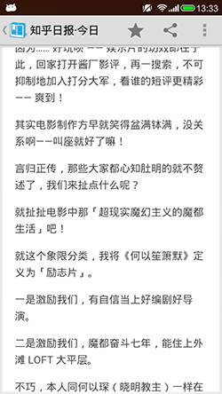

知乎日报·今日
==========

### 简介

一款轻量级的知乎日报APP，能够抓取知乎日报上的所有内容，能够缓存标题和简介，不支持离线查看。

开发环境为Eclipse ，另有一份使用 Android Studio 开发的见此处 [https://github.com/luciferldy/ZhihuToday_AS](https://github.com/luciferldy/ZhihuToday_AS)。

[最新版本下载地址](https://gitcafe.com/MaybeMercy/AppLibrary/raw/master/zhihupocket.apk)

### 依赖包

android-support-v7-appcompat.jar

[pulltorefresh](https://github.com/chrisbanes/Android-PullToRefresh)

[universalimageloader](https://github.com/nostra13/Android-Universal-Image-Loader)

### 截图

主屏幕界面
 

内容界面

### 技术细节

* 消息获取机制：对于今日消息先进行网络访问，成功获得数据后存入本地数据库，无网络连接时检索本地数据库；对于往日的消息，采用先检索本地数据库，数据库里没有信息的话，进行网络访问，成功后将将数据存入本地数据库

* 图片加载：使用开源框架universalimageloader, 使用所需图片的缩略图

* 刷新机制：使用pulltorefresh进行下拉刷新或者上拉刷新，每次下拉刷新清除所有视图，并且重绘今日消息的视图，每次上拉刷新是插入新的视图

* 内容界面：使用webview进行网页的加载

* README
